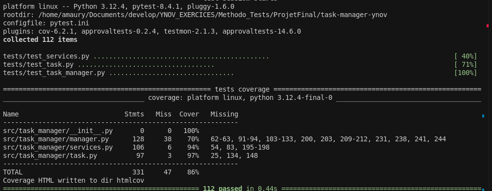

# Questions de l'étape 10

A ce stade nous avons suivi les consignes dans les TODO et implémenter les tests. 

Nous avons lancé la commande de couverture : 
`pytest --cov=src/task_manager --cov-report=html --cov-report=term-missing`

Commit de ce coverage : a51b603b85e612a61b7f2bad01407b16a3eeaad8

Les questions : 
- Quelles lignes ne sont pas testées ?
- Quels cas d'erreur manquent ?
- Y a-t-il du code mort ?

Voici l'état des lieux quand nous avons fait la première couverture de test : 



Nous ne repérons pas de code mort mis à part du code commenté que nous gardons pour l'instant.


En revanche nous repérons : 

En lien avec `task.py` :
- Un test ne couvre pas tous les Enum de priorité, il en manque un 
Class concernée dans tasks.py : 
```py
class Status(Enum): 

    TODO = "todo" 
    IN_PROGRESS = "in_progress" 
    DONE = "done" 
    CANCELLED = "cancelled" 

    def __str__(self) -> str: 
        return self.value 
```

La validation des titres échoues en partie, nous n'avons pas couvert cette exception : 
```py
 def _validate_title(self, title: str) -> None: 
    (...)
    raise ValueError(f"Title must be at least {self.MIN_TITLE_LENGTH} character") 
```

Le fichier `manager.py` est testé seulement à 70% et c'est lui qui pose le plus de problème.

Exceptions non testé : 
Lorsqu'une tâche est supprimé, dans la méthode `delete_task` on ne couvre pas ces lignes : 
```py

        try: 

            target_id = float(task_id) 

        except (ValueError, TypeError): 

            return False
```
On ne sait pas si l'id de la tâche est bien parsé car on ne sait pas si l'on tombe dans l'except.

Lorsque nous sauvegardons les tâches, nous les sauvegardons dans un fichier JSON. 
Or à ce stade peu de chose sont testé: 

Les deux dernières exceptions ici ne sont pas testé : 
```py
    def save_to_file(self, filename: Optional[str] = None) -> None:
        (...)
        except PermissionError as e: 

            raise PermissionError(f"Cannot write to file '{target_file}': {str(e)}. Check file permissions.") 

        except OSError as e: 

            raise OSError(f"File system error while saving '{target_file}': {str(e)}") 

        except Exception as e: 

            raise RuntimeError(f"Unexpected error while saving tasks: {str(e)}") 
```

Ce bloc entier n'est pas testé dans la méthide ` load_from_file`: 
```py

    try: 

            with open(target_file, 'r', encoding='utf-8') as file: 
                data = json.load(file) 

            if not isinstance(data, dict): 
                raise ValueError(f"Invalid JSON structure in '{target_file}': expected object, got {type(data)}") 
            tasks_data = data.get("tasks", []) 

            if not isinstance(tasks_data, list): 
                raise ValueError(f"Invalid tasks format in '{target_file}': expected array, got {type(tasks_data)}") 
            loaded_tasks = [] 

            for i, task_data in enumerate(tasks_data): 
                try: 
                    task = Task.from_dict(task_data) 
                    loaded_tasks.append(task) 
                except Exception as e: 
                    raise ValueError(f"Invalid task data at index {i} in '{target_file}': {str(e)}") 
            self._tasks = loaded_tasks 
        except json.JSONDecodeError as e: 
            raise json.JSONDecodeError( 
                f"Invalid JSON format in file '{target_file}'. File may be corrupted.", 
                e.doc, 
                e.pos 
            ) 
        except PermissionError as e: 
            raise PermissionError(f"Cannot read file '{target_file}': {str(e)}. Check file permissions.") 
        except Exception as e: 
            raise RuntimeError(f"Unexpected error while loading tasks: {str(e)}") 
```

Ce que cela signifie est que nous ne savons pas testé si l'on sait chargé un fichier json (où il y a nos différentes tâches) proprement : 
- Impossible de savoir si il est corrompu (structure json correcte ?).
- Si la structure de donnée où sont les tâches est bien un tableau avec une structure correcte.
- Si chaque tâche individuelle dans le tableau a tous les champs requis (id, title, priority, status, created_at).
- Si les types de données de chaque champ sont valides (ex: id doit être un nombre, dates doivent être au bon format ISO).
- Si la méthode `Task.from_dict()` peut échouer sur des données malformées et si l'exception est bien gérée.
- Si l'accès au fichier est refusé (permission denied) lors de la lecture.
- Si le fichier JSON est techniquement valide mais contient des données incohérentes.
- Si la réassignation `self._tasks = loaded_tasks` se fait correctement en cas de succès.

En situation réelle, ces scénarios non testés pourraient survenir fréquemment :
- Fichier modifié manuellement par l'utilisateur
- Corruption de fichier due à un arrêt brutal du système
- Problèmes de permissions sur certains systèmes
- Migration de données entre versions de l'application

Il y a alors des risques : 
- L'application pourrait planter brutalement si un utilisateur charge un fichier corrompu
- Aucune validation robuste des données persistées n'est vérifiée
- Les messages d'erreur personnalisés ne sont pas testés
- La récupération gracieuse d'erreurs n'est pas garantie

En situation réel néanmoins, je ne recommande pas l'usage d'un système de json pour remplacer une base de donnée.

le Manager a aussi d'autres pans de code non-testé : 

Les méthodes suivantes ne sont pas testées : 
- `get_all_tasks()`, 
- `get_task_count()`, 
- `__len__()` 

Voici en détail ces méthodes : 
```py
def get_all_tasks(self) -> List[Task]: 
    return self._tasks.copy() 

def get_task_count(self) -> int: 
    return len(self._tasks) 

def __len__(self) -> int: 
    return len(self._tasks) 
```

- Impossibilité de vérifier que `get_all_tasks()` retourne bien une copie et non la référence originale
- Risque de modification accidentelle de la liste interne si `.copy()` ne fonctionne pas
- Incohérence possible entre `get_task_count()` et `__len__()` si les implémentations divergent.


La méthode **`clear_all_tasks()` :** n'est pas testé  correctement : 
```py
def clear_all_tasks(self) -> None: 
    self._tasks.clear() 
```

Le problème : si l'on ne sait pas supprimer massivement les tâches, cela pose problème car on n'a aucune garantie que tous a été supprimmé, des références en doublon peuvent alors survenir car un json n'est pas aussi robuste qu'une base de donnée et seul un test peut nous prévenir. Il y a des effets de bords possible.

La fonction `validate_storage_environment` n'est pas testé ce qui engendre des problèmes critiques : 
- Impossible de créer des répertoires manquants 
- Impossible de savoir si le disque est plein ou si c'est un problème de permission sur notre machine ou une machine tiers (OSError).

La méthode `validate_json_file_limits(self)` n'est pas testé. Or cela veut dire que nous ne savons pas nous protéger avec certitude contre des envoi massif de fichiers qui pollue le système. On n'arrive plus à filtrer non plus les format de fichier car cette méthode impose le json.

`**`_get_current_time_iso()` :**` : cette fonction échoue donc on ne sait pas si le format ISO des dates est correcte.
