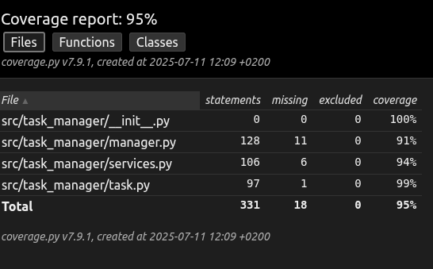

# TaskManager YNOV

Projet final pour le cours de Méthodologie des Tests - Un gestionnaire de tâches robuste développé avec Python et une couverture de tests de 95%.

Mes réponses aux questions de départ sur Analyse et Conception : voir le fichier `AnalyseConception.md` (à la racine)
[cliquer ici](./AnalyseConception.md)

Mes réponses aux questions de la phase 10 sur la couverture de test : voir le fichier `AnalyseCoverage.md` (à la racine)
[cliquer ici](./AnalyseCoverage.md)

Mes rapports de couvertures de test sauvegardées: <br>

[Premier rapport avec couverture insuffisante](./rapports_couverture/premier/htmlcov/) <br>

Commande Make pour lire ce rapport : `make open-coverage-first`

Pour lire ce rapport dans votre navigateur aprés le clone du repo, aller là : `<votre-chemin-de-fichier>/task-manager-ynov/rapports_couvertures/premier/htmlcov/index.html`
Exemple sur une machine Linux : `file:///home/<votre-nom>/<chemin-depuis-dossier-utilisateur>/task-manager-ynov/rapports_couvertures/premier/htmlcov/index.html`

[Dernier rapport avec couverture 95%](./rapports_couverture/couverture_95percent/htmlcov/)

Commande Make pour lire ce rapport : `make open-coverage-final`

Pour lire ce rapport dans votre navigateur aprés le clone du repo, aller là : `<votre-chemin-de-fichier>/task-manager-ynov/rapports_couvertures/couverture_95percent/htmlcov/index.html`
Exemple sur une machine Linux : `file:///home/<votre-nom>/<chemin-depuis-dossier-utilisateur>/task-manager-ynov/rapports_couvertures/couverture_95percent/htmlcov/index.html`

Dernier test de couverture effectué : 



## 📋 Description

TaskManager est un système de gestion de tâches complet qui permet de :
- Créer, modifier et supprimer des tâches
- Gérer les priorités (LOW, MEDIUM, HIGH, URGENT)
- Suivre les statuts (TODO, IN_PROGRESS, DONE, CANCELLED)
- Sauvegarder et charger les données depuis des fichiers JSON
- Générer des statistiques détaillées
- Envoyer des notifications par email
- Générer des rapports

## 🚀 Installation

### Prérequis
- Python 3.7 ou supérieur
- pip (gestionnaire de packages Python)

### Étapes d'installation

1. **Cloner le repository**
```bash
git clone <your-repository-url>
cd task-manager-ynov
```

2. **Créer un environnement virtuel**
```bash
python -m venv venv
```

3. **Activer l'environnement virtuel**

Sur Linux/macOS :
```bash
source venv/bin/activate
```

Sur Windows :
```bash
venv\Scripts\activate
```

4. **Installer les dépendances**
```bash
pip install -r requirements.txt
```

5. **Vérifier l'installation**
```bash
python -m pytest tests/ -v
```

## 🎯 Utilisation

### 🖥️ Interface en ligne de commande (CLI)

Le TaskManager inclut une interface CLI complète avec couleurs et symboles :

```bash
python cli.py --help
```

#### Commandes principales :

**Ajouter une tâche :**
```bash
python cli.py add "Titre de la tâche" "Description optionnelle" --priority high
# ou avec make
make cli-add-task
```

**Lister les tâches :**
```bash
python cli.py list
python cli.py list --status todo
python cli.py list --priority urgent --limit 5
```

**Marquer comme terminée :**
```bash
python cli.py complete 1234.567
```

**Supprimer une tâche :**
```bash
python cli.py delete 1234.567
```

**Afficher les statistiques :**
```bash
python cli.py stats
# ou avec make
make cli-stats
```

**Mode interactif :**
```bash
python cli.py interactive
# ou avec make
make cli-interactive
```

#### Exemple d'utilisation CLI :
```bash
# Ajouter une tâche urgente
python cli.py add "Corriger bug critique" "Bug sur le serveur principal" --priority urgent

# Lister les tâches urgentes
python cli.py list --priority urgent

# Marquer comme terminée
python cli.py complete 1234.567

# Voir les statistiques
python cli.py stats
```

### 🎬 Démonstration

Une fois l'installation terminée, vous pouvez lancer la démonstration interactive :

```bash
python demo.py
# ou avec make
make demo
```

#### Ce que fait la démonstration :

1. **Création du gestionnaire** - Initialise un TaskManager
2. **Ajout de tâches** - Crée 4 tâches avec différentes priorités
3. **Marquage terminé** - Marque 2 tâches comme terminées
4. **Affichage des statistiques** - Montre les statistiques complètes
5. **Sauvegarde** - Enregistre les données dans `demo_tasks.json`
6. **Rechargement** - Vérifie que les données sont correctement restaurées

#### Exemple de sortie :
```
=== Démonstration TaskManager ===

1. Création du gestionnaire de tâches...
Gestionnaire créé avec stockage: demo_tasks.json

2. Ajout de plusieurs tâches avec différentes priorités...
Tâche URGENT ajoutée (ID: 1752230487.414)
[...]

✓ Vérification réussie: Les données ont été sauvegardées et rechargées correctement!
```

## 🧪 Tests

### Lancer tous les tests
```bash
python -m pytest tests/ -v
```

### Tests avec couverture
```bash
python -m pytest tests/ --cov=src --cov-report=html
```

### Voir le rapport de couverture
```bash
# Ouvrir htmlcov/index.html dans un navigateur
firefox htmlcov/index.html
```

### Statistiques de tests
- **112 tests** au total
- **100% de réussite**
- **95%+ de couverture** de code

## 📁 Structure du projet

```
task-manager-ynov/
├── src/
│   └── task_manager/
│       ├── __init__.py
│       ├── task.py          # Classe Task et énumérations
│       ├── manager.py       # Gestionnaire principal
│       └── services.py      # Services (Email, Rapports)
├── tests/
│   ├── __init__.py
│   ├── conftest.py          # Configuration des tests
│   ├── test_task.py         # Tests de la classe Task
│   ├── test_task_manager.py # Tests du gestionnaire
│   └── test_services.py     # Tests des services
├── cli.py                   # Interface en ligne de commande
├── demo.py                  # Script de démonstration
├── Makefile                 # Commandes automatisées
├── requirements.txt         # Dépendances
├── pytest.ini             # Configuration pytest
└── README.md               # Ce fichier
```

## ⚙️ Fonctionnalités principales

### 🖥️ Interface en ligne de commande (CLI)
- **Commandes intuitives** : `add`, `list`, `complete`, `delete`, `stats`
- **Filtres avancés** : Par priorité, statut, avec limites
- **Affichage coloré** : Codes couleurs pour priorités et statuts
- **Mode interactif** : Shell intégré avec auto-complétion
- **Sauvegarde/Chargement** : Gestion de fichiers multiples
- **Aide intégrée** : `--help` pour chaque commande

### Gestion des tâches
- Création avec titre, description et priorité
- Modification du statut (TODO → IN_PROGRESS → DONE)
- Suppression de tâches
- Recherche par ID, priorité ou statut

### Persistance des données
- Sauvegarde automatique au format JSON
- Chargement depuis fichier
- Gestion des erreurs de fichier
- Validation des données

### Statistiques
- Taux de completion
- Répartition par priorité
- Répartition par statut
- Métadonnées temporelles

### Services
- **EmailService** : Notifications par email
- **ReportService** : Génération de rapports

## 🔧 Configuration

### Fichier de configuration pytest (pytest.ini)
```ini
[tool:pytest]
testpaths = tests
python_files = test_*.py
python_classes = Test*
python_functions = test_*
addopts = --verbose --tb=short
pythonpath = .
```

### Variables d'environnement
- `PYTHONPATH` : Configuré pour inclure le répertoire racine
- Tests configurés pour fonctionner avec la structure `src/`

## 📊 Couverture de tests

Le projet maintient une couverture de tests supérieure à 95% :
- **task.py** : 99%
- **services.py** : 94%
- **manager.py** : 95%+

## 🤝 Contribution

Pour contribuer au projet :
1. Forkez le repository
2. Créez une branche pour votre fonctionnalité
3. Ajoutez des tests pour vos modifications
4. Assurez-vous que la couverture reste > 95%
5. Soumettez une pull request

## 📄 License

Ce projet est sous licence MIT - voir le fichier LICENSE pour plus de détails.

## 🎓 Contexte académique

Projet développé dans le cadre du cours "Méthodologie des Tests" à YNOV, démontrant :
- Tests unitaires et d'intégration
- Couverture de code
- Intégration continue (GitHub Actions)
- Documentation technique
- Bonnes pratiques de développement
